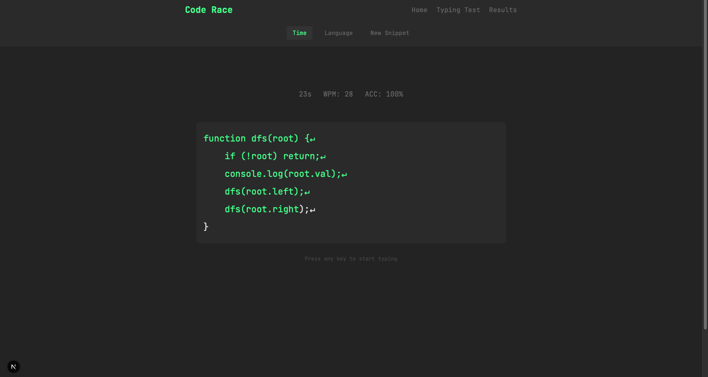
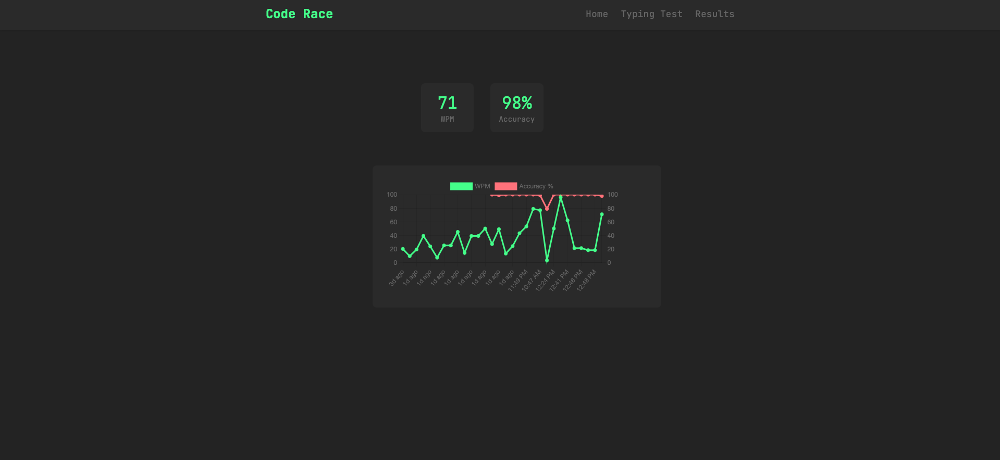

# Code-Race
Code Race is an engaging platform designed to test and reveal your typing speed while coding. Whether you are a seasoned developer or just starting out, Code Race provides an exciting way to improve your coding speed and accuracy.

## Features

- **Real-time Typing Speed Measurement**: Track your WPM (Words Per Minute) as you type
- **Code-Specific Testing**: Practice typing with actual programming code snippets
- **Multiple Language Support**: Choose from various programming languages including JavaScript, Python, Java, C++, and TypeScript
- **Accuracy Tracking**: Monitor your typing accuracy with real-time feedback
- **Performance Analytics**: View your progress with interactive graphs showing speed and accuracy trends
- **Customizable Tests**: Choose between timed tests (30s/60s) or complete snippet modes
- **Instant Feedback**: Get immediate visual feedback on correct and incorrect keystrokes
- **Code Syntax**: Practice with real code snippets maintaining proper syntax and indentation

## Tech Stack

- **Frontend**: Next.js, React, TypeScript, Chart.js
- **Backend**: Next.js
- **Styling**: CSS Modules

## Run Locally  
Clone the project  

~~~bash  
  git clone https://github.com/harsh23exe/Code-Race.git
~~~

Go to the project directory  

~~~bash  
  cd Code-Race
~~~

Install dependencies  

~~~bash  
npm install
~~~

Start the server  

~~~bash  
cd backend | npm run start
cd frontend | PORT=3001 npm run start

~~~  

## Screenshots

### Typing Test

### Results & Analytics

## License
This project is licensed under the MIT License. See the LICENSE file for more details.

I hope you enjoy using Code Race and find it to be a helpful tool in improving your coding skills. Feel free to reach out with any questions or feedback.